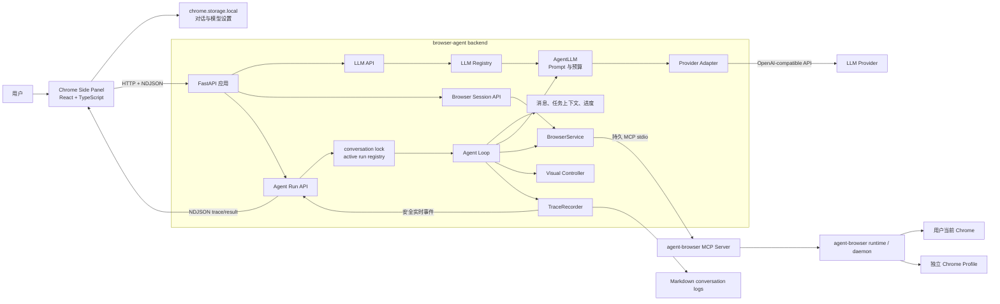
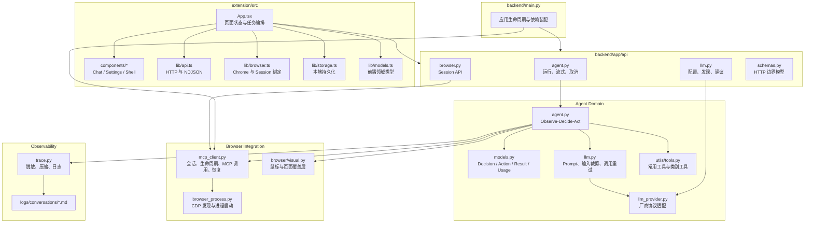
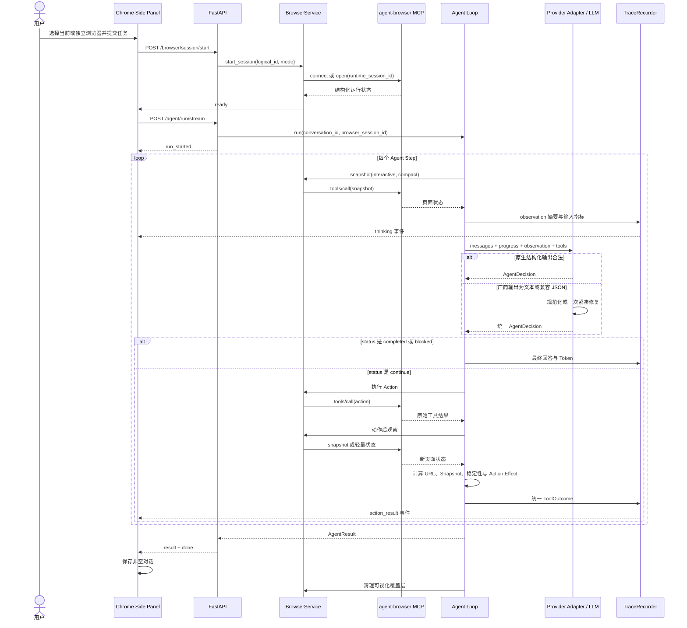

# Browser Agent 架构、对标分析与全面优化计划

> 审计时间：2026-08-04  
> 审计范围：`browser-agent` 全仓库、最新任务日志，以及本地 `browser-use`；关键设计另参考 `Skyvern` 与 `Nanobrowser`。  
> 目标：先解释并修复本次“网页任务已经成功，Agent 最终却报错”的根因，再给出一条保持简单、可验证、不过度设计的演进路线。

## 1. 执行摘要

本项目已经具备一条完整可运行的浏览器 Agent 链路：Chrome 侧边栏负责对话和浏览器模式选择，FastAPI 负责会话与任务 API，Agent Loop 负责观察、决策、执行，Provider Adapter 负责把不同模型输出收敛为统一领域模型，BrowserService 通过一个持久 MCP stdio 通道驱动 `agent-browser`，TraceRecorder 负责脱敏、压缩和实时轨迹。

当前最重要的结论有五个：

1. 最新任务不是浏览器执行失败，而是 **Provider Adapter 在最后一次模型输出修复时拒绝了兼容字段**。GitHub 已经收到 Fork 请求，页面处于 `Creating fork…`；修复模型把工具名写成 `type`，内部模型只接受 `name`，因此浏览器进度被一次格式错误覆盖成最终失败。
2. 本次已在 Provider 边界增加 `type → name` 的通用归一化，并用真实失败形状编写回归测试。它不包含 GitHub、Fork 或某个模型的站点特判。
3. 项目目前最大结构风险不是“工具太少”，而是 **状态仍以松散字典流动、单步决策异常直接终止任务、元素 ref 没有快照版本、页面稳定判断过于粗糙**。这些问题会共同造成“网页已经做完，但 Agent 不知道或无法可靠确认”。
4. `browser-use` 最值得吸收的是统一 ActionResult、结构化 BrowserState、工具注册元数据、连续动作的页面变化保护、可恢复的单步失败，以及有预算的历史压缩；不值得照搬的是其完整事件总线、十多个 Watchdog 和直接 CDP 实现，因为本项目已经选择 `agent-browser + MCP` 作为浏览器执行层。
5. 全仓扫描发现一个独立的高优先级仓库问题：`.gitignore` 中未锚定的 `lib/` 会忽略 `extension/src/lib/*`。当前扩展依赖这些文件并能在本机构建，但这些文件不会进入 Git，干净检出后会缺失。

建议按“协议边界 → 可恢复循环 → 状态与动作契约 → 观察与上下文 → 日志与工程化”的顺序推进。不要先引入 Planner、多 Agent、向量记忆或重写浏览器内核。

## 2. 最新日志：为什么实际成功，最终却显示失败

### 2.1 日志证据

最新日志是：

```text
backend/logs/conversations/conversation-7932ec90-b9a6-42bb-b835-26763a148671.md
```

任务路径本身是正常的：

1. 打开 GitHub 仓库搜索，并按 Star 降序查找 AI 仓库。
2. 进入 `openclaw/openclaw`，日志记录约 385k Star，满足大于 10k 的条件。
3. 进入 Fork 表单。
4. 点击 `Create fork`。
5. 下一份页面状态中，按钮变成禁用的 `Creating fork…`。

`Creating fork…` 说明创建请求已经提交，GitHub 正在异步创建仓库。此时网页侧的写操作已经发生，不能把后面的模型格式错误解释成“Fork 没有提交”。

最后一轮模型也正确理解了页面状态，并想继续等待：

```text
status: continue
next_goal: 等待 fork 创建完成并跳转
action: agent_browser_wait_for_url
```

但模型的原始输出不是合法 JSON。Provider Adapter 随后发起一次紧凑 JSON 修复，修复结果中的 action 是：

```json
{
  "type": "agent_browser_wait_for_url",
  "arguments": "{...}"
}
```

内部传输模型此前只接受：

```json
{
  "name": "agent_browser_wait_for_url",
  "arguments": "{...}"
}
```

因此 Pydantic 报错：

```text
actions.0.name Field required
```

Agent Loop 把 `provider_output_invalid_json` 当成终止错误，于是最终回答被写成“模型返回格式异常”，覆盖了浏览器已经提交 Fork 的事实。

### 2.2 精确因果链

```text
GitHub 创建请求提交成功
→ 页面进入 Creating fork…
→ LLM 决定继续等待，但输出为 Markdown/YAML
→ Provider 发起 JSON 修复
→ 修复结果用 type 表示工具名
→ Provider 传输模型只接受 name
→ 结构校验失败
→ Agent 把可恢复的格式错误当作任务终局
→ 用户看到 failed
```

所以根因不在 click、MCP、GitHub 或浏览器 Session，而在两个相邻边界：

- 直接根因：Provider 兼容层没有收敛常见的 `type/name` 差异。
- 放大因素：Agent Loop 对 Provider 输出错误没有单步失败预算，第一次无法恢复就结束整个任务。

### 2.3 本次已实施的修复

Provider 专用传输模型现在接受 `name` 或 `type`，进入内部领域模型时统一得到：

```text
AgentAction(name: str, arguments: dict)
```

修改被限制在 Provider Adapter 边界，内部 Agent、工具执行器和 MCP 协议都不需要感知兼容字段。这样保持了用户之前提出的设计原则：

```text
厂商差异
→ Provider Adapter 收敛
→ 统一 AgentDecision / AgentAction
→ Agent Loop 与浏览器层不感知厂商
```

对应测试先复现 `actions.0.name Field required`，再验证 `type` 能被还原成内部 `name`。全量回归结果：

- 后端：112 tests + 11 subtests 通过。
- 扩展：21 tests 通过。
- 扩展 TypeScript 与 Vite 生产构建通过。

### 2.4 仍需继续加固的地方

这次兼容修复能解决最新日志中的确切失败，但还应增加一层小而通用的保护：Provider 输出或 schema 校验失败时，把它记录成一次可恢复的 StepFailure，允许同一观察最多再决策一次；只有连续失败达到预算才结束任务。

这不是重复 JSON 修复。两层职责不同：

- Provider Adapter 修复“这一次响应如何转换成合法领域对象”。
- Agent Loop 处理“这一步没有形成合法决策，任务是否仍有继续价值”。

对于点击、提交、发布等不可逆动作，第二层尤其重要，因为格式失败不等于网页动作失败。

## 3. 当前项目架构图



### 3.1 架构特征

- 浏览器执行内核在 `agent-browser`，本项目负责 Agent、会话、模型、上下文和产品 UI。
- 后端进程只建立一个 MCP stdio 通道，多个逻辑浏览器会话在该通道上串行调用各自 runtime session。
- 对话 Agent、LLM 配置、运行登记主要保存在进程内存；用户对话保存在扩展本地存储。
- 日志既是诊断记录，又被转换成前端实时轨迹，但两者应继续保持“诊断信息多、公开信息少”的边界。

## 4. 模块与组件图



### 4.1 当前模块边界评价

| 模块 | 做得好的地方 | 当前主要问题 |
| --- | --- | --- |
| `api/*` | 已从 `main.py` 拆出业务 API；HTTP schema 独立 | readiness 与 liveness 未分开；流式队列无上限 |
| `models.py` | AgentAction、AgentDecision、TokenUsage 已有明确领域模型 | BrowserObservation、ToolOutcome、StepFailure 仍是 `dict[str, Any]` |
| `llm_provider.py` | 已形成 Provider Adapter 边界；本次兼容修复位置正确 | 目前只有一个 Responses 实现；“OpenAI 兼容”被当成“行为完全相同” |
| `agent.py` | 单一 Observe-Decide-Act 路径容易理解；已有 action effect 与上下文压缩 | 996 行且同时承担状态机、上下文、执行、恢复和历史；决策异常直接终止 |
| `mcp_client.py` | 逻辑 Session 与 runtime Session 分离；持久 MCP；有超时与断线恢复 | 912 行混合注册表、启动、CDP、传输、恢复和清理；全通道阻塞影响所有会话 |
| `utils/tools.py` | “常用工具 + 类别获取器”足够简单，符合当前产品方向 | 元数据只有名称/描述，缺少参数预校验、页面变化和重试语义 |
| `trace.py` | 北京时间、脱敏、Snapshot hash 去重、前端发布前压缩已具备 | Markdown 是主存储；缺少 schema version、阶段耗时、索引与保留策略 |
| `extension` | UI 已拆出组件和 `lib`；有 AbortController、NDJSON、历史过滤 | `App.tsx` 仍是集中式编排；`src/lib` 被 `.gitignore` 误伤 |

## 5. 业务时序图



### 5.1 目标恢复语义

正常流程之外，建议统一以下恢复顺序：

```text
Provider 格式错误
→ Provider 边界规范化或修复一次
→ 仍失败则生成 StepFailure
→ Agent 在同一观察上再决策一次
→ 连续达到预算才结束

浏览器工具超时
→ 标记 uncertain，不立即假设失败
→ 读取一次动作后状态
→ 页面已变化则收敛为 succeeded
→ 页面未变化才把超时反馈给下一轮

浏览器连接断开
→ 仅在原 runtime / 原 CDP 目标上恢复一次
→ 恢复失败则结束，不切换浏览器模式、不创建替代 profile
```

## 6. 与 browser-use 的设计对比

| 维度 | 当前项目 | browser-use | 建议 |
| --- | --- | --- | --- |
| 浏览器内核 | 外部 `agent-browser`，通过 MCP | 自有 `cdp-use`，直接 CDP | 保留 MCP，不重写内核 |
| 浏览器状态 | MCP 返回字典与文本 snapshot | `BrowserStateSummary`，含 DOM、URL、tabs、截图、网络、事件 | 在本项目建立轻量 `BrowserObservation`，不复制完整 CDP 树 |
| 元素身份 | 当前 snapshot 中的 `@eN` | selector map + backend node id + stable hash + AX name | 增加 snapshot revision、语义描述和序号；稳定 backend id 需上游支持 |
| 工具注册 | MCP 工具缓存 + 常用集合 + 类别获取器 | Typed Registry 动态生成 Pydantic ActionModel | 保留分层工具面，增加参数校验与行为元数据 |
| 工具结果 | 运行时统一成字典 envelope | 所有工具统一 `ActionResult` | 把现有 envelope 升级为 Pydantic `ToolOutcome` |
| 多动作保护 | 静态 `OBSERVATION_REQUIRED_ACTIONS` 后中断 | `terminates_sequence` + 运行时 URL/焦点变化 | 用工具元数据替代超长静态集合，并保留运行时保护 |
| 单步异常 | LLM 决策异常直接结束任务 | 记录 `ActionResult(error=...)`，累计 consecutive failures | 引入小预算 StepFailure，不让一次格式错结束任务 |
| 循环检测 | 相同动作 + 相同页面指纹三次后硬失败 | 滚动窗口、页面停滞、先给 nudge | 第一次警告，达到更高阈值才终止；wait/scroll 等动作单独规则 |
| 页面观察 | 每个需要观察的动作后完整 snapshot | 状态缓存；DOM 与截图并行；有限网络探测 | 用 diff/轻量状态优先，只有需要时完整 snapshot |
| 上下文 | 字符阈值、最近完整结果、hash/preview | HistoryItem、一次性 extracted content、compacted memory | 引入进度账本和 token 预算，保留当前简单压缩 |
| 完成判断 | 同一决策模型给 evidence 与 final answer | done action；可选 judge；失败后最后一次 final response | 先做规则化完成门，不默认增加第二个 Judge LLM |
| LLM 适配 | OpenAI Responses Adapter 兼容所有地址 | OpenAI、DeepSeek、Anthropic 等独立 Adapter/Serializer | 建立 provider capability profile，按需增加适配器 |
| 超时 | LLM 30 秒；MCP 工具 30 秒；部分重试 | request timeout、step timeout、reconnect wait 等多层预算 | 增加 run/step 总预算；避免多个 30 秒串行相加 |
| 工程化 | `requirements.txt` 宽松下界 | `pyproject.toml`、`uv.lock`、Ruff、Pyright、pytest-timeout、CI | 采用轻量 `pyproject + uv.lock + lint/type/test` |

### 6.1 同一个思想的部分

当前项目和 browser-use 在以下核心思想上已经一致：

- Agent 内部只处理统一动作与决策，不应知道各厂商 API 细节。
- 工具结果必须进入下一轮模型，而不是只留下 `succeeded`。
- 大型页面与工具结果只能完整出现一次，后续以摘要或 hash 表示。
- 页面变化后的连续动作必须停止，不能拿旧 ref 继续点新页面。
- 浏览器 Session 和 Agent 对话不是同一个对象，应分别管理生命周期。
- 完成必须带证据，不能仅根据“工具返回成功”宣布完成。

### 6.2 不同思想及原因

最大的不同是浏览器边界。browser-use 直接拥有 CDP、DOM 树和页面事件，所以能构建稳定 backend node identity、Watchdog、网络请求列表和截图缓存。本项目通过 MCP 使用 `agent-browser`，浏览器细节由上游持有。

这意味着本项目不应该复制一套第二 DOM 引擎。合理做法是：

1. 优先消费 `agent-browser` 已提供的 snapshot、diff、URL、tabs 和工具 schema。
2. 在 Agent 层增加 snapshot revision、语义块、动作效果和上下文策略。
3. 如果稳定 backend node id 是刚需，应推动 `agent-browser` 在 MCP 结果中暴露，而不是在后端大量 `eval` 重建。

## 7. Skyvern 与 Nanobrowser 的补充启示

### 7.1 Skyvern

Skyvern 的页面就绪不是一个无限等待的布尔判断，而是拆成：

- loading indicator 是否消失；
- network idle 是否达到短窗口；
- DOM 是否稳定一小段时间。

每项有独立短预算，超时通常表示“该信号不可靠，继续”，而不是让整个动作卡满统一 30 秒。它的 ActionResult 还明确包含 success、exception、retry number、是否跳过剩余动作和是否需要 follow-up。

本项目应借鉴“多信号、短预算、可观测”，但不应在 X、Reddit 等持续联网页面上强制等待 `networkidle`。

### 7.2 Nanobrowser

Nanobrowser 把 Navigator 与 Planner 分开，Navigator 宣布完成后仍交给 Planner 验证；它还把交互元素保存为历史身份，使用父路径、属性和 XPath hash 在后续 DOM 中重新定位。

本项目当前不需要立即引入第二个 Agent。更轻的做法是先建立完成门：

- 读任务可以由最新观察 + 已提取内容完成。
- 写任务必须看到提交后的状态变化、目标对象存在或明确成功提示。
- 若证据仍是 `pending/creating/submitting`，状态只能是 continue 或 uncertain。

## 8. 全仓问题与优化机会

### 8.1 P0：正确性与可运行性

#### P0-1 Provider 输出错误会覆盖真实浏览器进度

现状：Provider Adapter 已尝试规范化和修复，但修复结果仍不合法时，Agent 在 `stage=loop` 直接返回失败。

风险：提交、Fork、评论、支付前置步骤等动作已经发生，最终结果却显示失败；用户重试可能造成重复写操作。

改法：保留本次边界归一化；再增加最多一次 StepFailure 决策重试。重试复用当前观察，不自动重做上一个写动作，并把“动作可能已生效”作为显式上下文。

#### P0-2 `extension/src/lib` 不会进入 Git

现状：根 `.gitignore` 的 `lib/` 匹配任意层级目录，`extension/src/lib/api.ts` 等文件被忽略。当前 `App.tsx` 已导入这些文件。

风险：当前机器测试通过，干净 clone、CI 或其他开发者环境无法构建。

改法：将 Python 构建目录规则锚定到根目录，例如 `/lib/`，或显式反忽略 `/extension/src/lib/**`；随后把这些源码纳入版本控制，并增加 clean-checkout build CI。

#### P0-3 API 存活状态与 MCP 就绪状态耦合

现状：FastAPI 只有进入 MCP lifespan 上下文后才 `yield`。MCP 初始化失败时，整个 API 无法启动，`/health` 也不可用。

风险：前端只能看到笼统 503，无法区分“后端没启动”和“浏览器传输没就绪”。

改法：API 可先启动；后台初始化 BrowserRuntimeSupervisor。提供 `/health/live` 和 `/health/ready`，ready 返回 MCP 状态、工具缓存状态和最后错误。Agent/Session API 在未就绪时返回结构化 503。

#### P0-4 不可逆动作缺少幂等与最终状态保护

现状：工具超时可标记 uncertain 并观察页面，这是正确方向；但 Provider 失败、客户端断流或手动重试时没有统一 pending mutation 记录。

风险：用户看到失败后重试，可能重复 Fork、重复评论或重复提交表单。

改法：只为明显写操作记录短期 `MutationIntent`：动作签名、页面、派发时间、动作后证据和状态。恢复时先观察，不自动重放相同写动作。

### 8.2 P1：Agent 任务质量

#### P1-1 页面状态仍是松散字典

现状：Agent、LLM、Trace 通过 `Any` 和 `dict[str, Any]` 传递 observation、tool result 和 effect。

影响：同一字段在 MCP 原始结果、模型上下文、日志和前端轨迹中可能出现不同结构；修改一处容易遗漏其他消费者。

改法：增加三个最小模型：

- `BrowserObservation`：revision、url、title、tabs、snapshot、snapshot hash、source/sent chars、stability。
- `ToolOutcome`：action id、name、arguments、status、data、error、effect、timing。
- `StepFailure`：stage、code、retryable、uncertain、message、attempt。

这些模型先包住现有数据，不要求一次重写 MCP 返回。

#### P1-2 ref 没有快照版本和稳定身份

现状：`@e107` 只在生成它的 snapshot 上有意义，但动作中没有携带 snapshot revision。页面变动后，模型或上下文可能继续使用过期 ref。

改法：每份观察生成 revision；AgentAction 记录 `observation_id`。执行 ref 动作前确认它来自当前观察。模型上下文中为元素补充 role、name、href、所属语义块和列表序号。过期 ref 返回 `stale_element_ref`，而不是普通 Element not found。

#### P1-3 原始可访问性树缺少列表和内容边界

现状：页面顺序可见，但“第一条帖子”“第一条推文”“正文与评论”没有结构化边界；heading、link、generic 可能共同描述一个实体。

改法：在 snapshot 文本之上增加轻量语义块，不做站点特例：

- 根据 article/listitem/heading/link 层级形成 block。
- 每个 block 有 ordinal、title、primary action、metadata、text preview。
- 正文读取结果与交互树分开，避免同一内容在 refs 与 snapshot 中重复。
- 若无法可靠分块，回退现有 snapshot，不猜测站点私有组件。

#### P1-4 页面就绪与动作效果粒度不足

现状：页面效果主要比较 URL 和整份 snapshot hash；空 snapshot 只固定等待 200ms 后重试一次。

改法：为页面变化动作使用短预算稳定策略：

1. 立即读取 URL、title、tab/focus。
2. 需要时读取 diff snapshot。
3. 若出现 loading/creating/submitting 或空状态，在总预算内退避重试。
4. 网络持续活跃不阻止完成；DOM/关键元素稳定优先。
5. 每个信号单独记录耗时和结果。

#### P1-5 完成判断仍主要依赖模型自报

现状：`completion_evidence` 是必填，这比无证据完成更好；但 schema 只验证“有字符串”，不验证证据是否来自当前状态。

改法：按任务影响分级：

- 只读任务：提取内容或当前页面证据即可。
- 导航/设置任务：最终 URL、控件状态或页面文本必须匹配。
- 写任务：需要提交后成功提示、目标对象存在、URL 转换，或至少 pending 状态；pending 不能 completed。

第一阶段使用规则完成门，不增加额外 LLM。只有评测证明自报误判仍高，再考虑可选 Validator。

#### P1-6 循环检测过硬且过窄

现状：完全相同的 action + arguments + page fingerprint 达到三次就直接失败；它检测不到语义相同但参数略变的循环，也可能误伤合法的重复 scroll/wait。

改法：第一次检测到停滞时向下一轮加入 nudge；第二层结合最近动作类型、URL、元素数和 snapshot 相似度；达到硬阈值才结束。wait、scroll、读取分页要有独立规则。

### 8.3 P1：速度与 Token

#### P1-7 每轮仍把稳定工具说明放入 Prompt

现状：常用工具与类别获取器每轮格式化进 system prompt。当前分层工具策略合理，但稳定前缀仍重复计费，是否命中 Provider 缓存不可见。

改法：保持工具分层，不做动态暴露全部工具；固定系统提示和常用工具顺序，记录 cached tokens 与 prompt fingerprint。类别工具只在模型主动获取后，把结果保留一轮并 hash 化。

#### P1-8 字符预算不能准确代表不同模型 Token

现状：Snapshot、task context 和 conversation 主要按字符截断，Provider usage 可用于事后统计，但不能精确指导截断。

改法：引入 provider/model token estimator 接口；有 tokenizer 时用精确估算，没有时用保守字符比例。预算按 system、history、observation、tool results 四个槽位分配，日志记录每槽预计与真实 Token。

#### P1-9 完整 Snapshot 仍是主要观察手段

现状：每个需要观察的动作后都重新 snapshot。虽然已有 compact、截断、refs 去重和日志 hash，但动态大页面仍贵。

改法：优先顺序改为：缓存可复用 → URL/tab 轻状态 → diff snapshot → 完整 snapshot。点击后若 URL 与 DOM 都未变化，直接把 no-effect 交给模型；若 diff 足以确认结果，不再抓完整树。

#### P1-10 可视化覆盖层产生内部工具噪声

现状：一次可见动作可能额外执行 eval、get_box、pointer eval。它们与业务工具共享 MCP 通道和日志，慢页面上会放大延迟。

改法：可视化保持 best-effort，设置独立很短预算；将内部调用聚合成一条 `visual_effect` 事件，不进入 LLM task context；失败不能影响主动作。真实性能数据表明价值有限时，可允许关闭。

### 8.4 P1：工具与错误处理

#### P1-11 MCP 参数只在远端执行时验证

现状：模型动作只检查工具名是否注册；arguments 的字段名和类型交给 MCP/CLI 后才知道错误。

影响：一次可在本地发现的 `timeout` / `waitTimeoutMs` 错误也会占用浏览器调用和下一轮 LLM。

改法：使用缓存的 MCP inputSchema 在调用前验证；返回统一 `invalid_tool_arguments`，包含合法字段的短提示。不要自动猜测任意参数别名，只有 Provider 协议层的明确兼容差异才归一化。

#### P1-12 工具行为靠静态名称集合维护

现状：`OBSERVATION_REQUIRED_ACTIONS` 在 Agent 内硬编码，新增工具容易漏掉。

改法：为工具构建最小元数据：`changes_page`、`terminates_sequence`、`read_only`、`retry_policy`、`result_visibility`。默认保守，只有明确安全的读取动作允许连续执行。

#### P1-13 错误类型跨层丢失

现状：部分错误已有 code/retryable，部分仍只有异常字符串；前端主要靠 HTTP status 和 friendlyError。

改法：建立稳定错误码表，至少区分 provider_output、provider_transport、browser_transport、session_disconnected、tool_timeout、tool_validation、stale_ref、task_cancelled。异常详情仅写诊断日志，公开 API 返回 code、message、retryable、action。

### 8.5 P2：日志、追踪与安全

#### P2-1 Markdown 不适合作为唯一事件源

现状：每个事件以 JSON code block 追加到 Markdown，人工阅读方便，但难以可靠查询、聚合、分页和迁移。

改法：以 versioned JSONL 为主事件源，Markdown 由同一事件渲染生成或按需查看。事件必须有 conversation_id、run_id、step_id、action_id、sequence、phase、duration_ms、schema_version。

#### P2-2 Trace 缺少完整阶段耗时

现状：已有 LLM timeout、browser transport slow 事件和 Token，但不能直接回答“一步 43 秒分别花在哪里”。

改法：记录 observe、prompt_build、llm_request、provider_repair、visual_prepare、tool_dispatch、stabilize、trace_write 的耗时；汇总 p50/p95，而不是只查看单次超时。

#### P2-3 脱敏仍依赖字段名与有限 query 参数

现状：已处理 api key、authorization、token 等字段和部分挑战参数，这是明显进步；但秘密可能出现在任意 value、URL path、fragment 或页面正文。

改法：学习 Skyvern 的持久日志策略：URL 分段 scrub、secret-shaped value 检测、action 参数按工具类型脱敏。原始敏感值只存在执行内存，不进入 durable trace 和前端事件。

#### P2-4 日志生命周期没有正式策略

现状：日志目录会持续增长，之前只能人工全删。

改法：增加容量和时间双限制，例如保留最近 N 天且总量不超过上限；正在运行日志不清理。提供显式清理 API 或维护命令，并记录删除数量，不在请求路径同步扫描全部文件。

### 8.6 P2：Session 与 MCP 运行时

#### P2-5 一个持久 MCP 通道是优点，也是故障域

现状：复用通道减少启动成本；但某次底层请求卡死或 framing 异常时，所有逻辑 session 都受影响。每个 browser session 的 tool lock 不能解除 stdio 通道本身的阻塞。

改法：增加 `BrowserRuntimeSupervisor` 状态机：starting、ready、degraded、restarting、stopped。连续 transport timeout 后重建 MCP 通道一次，而不是只重启某个浏览器 runtime。重建期间拒绝新动作，避免请求堆积。

#### P2-6 BrowserService 职责过多

现状：会话注册、模式启动、当前 Chrome CDP 发现、runtime 生命周期、MCP 调用、重试、orphan cleanup 都在一个类中。

改法：只拆三个有清晰收益的组件：

- `BrowserSessionRegistry`：逻辑 ID、runtime ID、状态和锁。
- `BrowserRuntimeSupervisor`：MCP 通道、工具缓存、通道恢复。
- `BrowserLauncher`：current/isolated/existing 的启动与关闭。

不要再继续细拆 repository、manager、factory 层。

### 8.7 P2：API 与前端

#### P2-7 流式队列没有背压

现状：每个 run 使用无界 `asyncio.Queue`；客户端断开后，任务可能继续产生事件，断连检测依赖生成器回收。

改法：使用小型有界队列，只保留用户可见事件；重复 thinking/action progress 可合并。检测 request disconnect 后取消任务或按明确策略转后台。

#### P2-8 后端对话与 Session 只在内存

现状：后端重启后 Agent 历史、锁和 runtime 映射消失；扩展仍保留对话 UI。

改法：短期不引入数据库。定义明确的重启语义：对话文本可恢复，但旧 Agent 执行记忆不恢复；浏览器会话重新显式连接。为 agents、locks 和 sessions 增加 TTL 清理，避免长期进程无限增长。

#### P2-9 `App.tsx` 仍承担过多编排

现状：组件已拆分，但新建对话、浏览器绑定、模型同步、任务流、取消、存储和错误处理仍集中在约 500 行组件中。

改法：在 `src/lib` 被正确纳入 Git 后，仅提取两个 hook：`useConversationStore` 与 `useAgentRun`。不要引入 Redux；现有状态规模不需要全局状态库。

### 8.8 P2：技术栈与工程流程

#### P2-10 后端依赖不可复现

现状：只有五个宽松最低版本，没有 lockfile、Python 版本、lint、type check 和测试超时配置。上游升级可能在未改代码时改变行为。

改法：增加最小 `pyproject.toml` 与 `uv.lock`，固定生产依赖；配置 Ruff、Pyright basic、pytest-asyncio 和 pytest-timeout。CI 顺序为 lint → type → unit → extension test/build。

#### P2-11 测试偏单元，缺少协议与场景契约

现状：单元测试数量和覆盖场景已经较好，但缺少干净 clone、真实 MCP schema、断线、长页面、异步提交和多 Provider fixture。

改法：建立四层测试：

1. 纯模型/工具单元测试。
2. Provider contract fixtures，包括 OpenAI、DeepSeek 与兼容代理的原始响应形状。
3. Fake MCP transport chaos tests，包括超时、迟到响应、断线和重建。
4. 本地确定性网页 E2E，再加少量真实网站 smoke test。

## 9. 分阶段修改计划

### 阶段 0：修复边界与仓库完整性

目标：网页操作不能再因为最后一次格式问题被误判失败，干净检出必须能构建。

工作项：

1. 保留已完成的 Provider `type/name` 边界归一化。
2. 增加 Provider 输出错误的一次 StepFailure 重试，不重放上一步动作。
3. 修正 `.gitignore`，纳入 `extension/src/lib`。
4. 增加 clean-checkout extension build 测试。
5. 对写动作增加最小 pending mutation 记录，重试前先观察。

改造前：一次 Provider 格式错误即可结束任务；本机存在但未跟踪的源码让构建结果不可复制。  
改造后：格式失败成为一次有预算的步骤失败；写操作不会盲目重做；任意干净检出都能通过构建。

验收：

- 用最新日志响应 fixture 重放，必须继续执行 `wait_for_url` 或下一次观察，不能直接 failed。
- 连续两次无效 Provider 输出才按明确错误结束。
- 格式恢复期间 click/create 等写动作调用次数保持为 1。
- 新目录 clone 后后端测试、扩展测试和构建全部通过。

### 阶段 1：统一状态与工具契约

目标：让 Agent、LLM、Trace 和 API 对同一结果使用同一结构。

工作项：

1. 引入 `BrowserObservation`、`ToolOutcome`、`ActionEffect`、`StepFailure`。
2. 在 MCP 边界一次性 unwrap，之后不再传递多种成功结构。
3. 使用 MCP inputSchema 本地验证参数。
4. 为工具生成行为元数据，替代 Agent 中的长静态集合。
5. 连续动作使用 `terminates_sequence` 和 URL/tab/focus 变化双保护。

改造前：同一工具结果在不同层是不同字典；错误语义依赖字符串。  
改造后：所有消费者读取同一 typed envelope；错误可判断 retryable/uncertain；新增工具不需要手改多个集合。

验收：

- 所有 MCP 工具无论成功、业务失败、超时或异常都产生同一个 ToolOutcome schema。
- 非法参数不进入 MCP，错误包含合法字段提示。
- 页面已变化时，排队的旧 ref 动作绝不继续执行。

### 阶段 2：页面观察、ref 与稳定性

目标：用更少页面数据得到更可靠的操作证据。

工作项：

1. 每份 snapshot 增加 revision 与 observation_id。
2. ref 动作绑定产生它的 observation；过期时返回 stale_ref。
3. 建立轻量语义块和列表 ordinal。
4. 引入 URL/tab 轻状态、diff snapshot、完整 snapshot 的分级策略。
5. 实现多信号短预算稳定判断并记录各阶段耗时。

改造前：`@e107` 没有版本；几乎所有重要动作后都抓完整页面；“第一条内容”依赖模型从原始树猜。  
改造后：ref 的有效范围明确；常见动作只取必要状态；列表项有稳定顺序和内容边界。

验收：

- 使用旧观察的 ref 会在本地被拒绝，且下一轮得到新 snapshot。
- Reddit/X 类测试页中的第一条非置顶内容有明确 ordinal。
- 典型任务平均完整 snapshot 次数下降至少 30%。
- 页面稳定等待 p95 有上限，持续网络页面不会固定卡满 30 秒。

### 阶段 3：上下文与任务完成质量

目标：减少 Token 和无效步骤，同时提升完成可信度。

工作项：

1. 将 task context 改成 progress ledger + recent outcomes + extracted facts。
2. 大结果完整进入一次，之后只保留事实、hash 和按需引用。
3. 使用 token slot budget 替代单纯字符裁剪。
4. 实现只读、导航、写任务三档完成门。
5. 循环检测先 nudge，后硬停；最后一步要求输出可用的部分结果。

改造前：模型可能反复看到相同描述；evidence 只验证非空；失败后可能多轮盲试。  
改造后：上下文保留“已完成、当前状态、下一步、最近错误”；完成证据必须对应当前 observation 或已确认 action effect。

验收：

- 最新同类任务输入 Token 中位数下降至少 25%。
- 已经 read 到正文的任务不再无意义 click 进入详情页。
- 写任务在 pending 状态不会 completed。
- 连续无进展平均恢复轮数下降，且不增加误终止率。

### 阶段 4：日志、指标与安全

目标：任何失败都能从一条运行链路回答“慢在哪里、错在哪里、是否已经产生副作用”。

工作项：

1. JSONL 作为 versioned 事件源，Markdown 作为视图。
2. 全链路唯一 run/step/action/observation ID 与 sequence。
3. 记录阶段耗时、Provider repair、action effect、Token slot 和截断。
4. 扩展 URL/path/fragment/value 脱敏。
5. 增加日志保留、容量上限与显式清理。

改造前：日志适合人工浏览但难聚合；同类错误与上下文可能重复；安全依赖字段名。  
改造后：日志可流式、可查询、可聚合；Markdown 不复制完整上下文；敏感值在持久化之前统一删除。

验收：

- 一次 run 能计算各阶段耗时总和，误差可解释。
- 重复 snapshot 只保存一个正文预览，后续只保存 hash。
- 测试 token、authorization、挑战参数、URL fragment 和 secret-shaped value 均不落盘。
- 设定数量的测试任务日志体积有稳定上限。

### 阶段 5：运行时与工程化

目标：降低 MCP 故障域，建立可复制的质量门。

工作项：

1. BrowserRuntimeSupervisor 与 live/ready 健康检查。
2. 在连续传输超时后有预算地重建 MCP 通道。
3. 按 Registry / Supervisor / Launcher 三块拆分 BrowserService。
4. 后端引入 pyproject、uv lock、Ruff、Pyright、pytest timeout。
5. 前端提取 `useConversationStore`、`useAgentRun`，增加流断开与取消测试。

改造前：MCP 初始化失败等于整个 API 不可用；依赖升级不可复现；大型类承担过多职责。  
改造后：API 可诊断 browser runtime 未就绪；通道恢复有明确状态；代码边界和 CI 能阻止退化。

验收：

- MCP 不可用时 `/health/live` 仍返回，`/health/ready` 明确失败原因。
- 模拟同一持久通道连续超时后只重建一次，没有并发重启风暴。
- 锁文件安装与 CI 结果一致。
- Ruff、Pyright、后端测试、扩展测试和 build 全部成为必过门。

### 阶段 6：评测驱动优化

目标：只保留真实提升成功率或速度的优化。

建立固定任务集：

- 只读：总结当前页、读取第一条内容、提取正文与评论。
- 导航：按排序找到第一项、跨页面切换语言或主题。
- 表单：填写、校验、提交前停止。
- 写操作：Fork、评论等使用测试账户和可回收目标。
- 动态站点：持续网络、懒加载、overlay、新 tab、SPA。
- 故障注入：LLM 超时、无效 JSON、MCP 超时、迟到响应、断线。

核心指标：

| 指标 | 目的 |
| --- | --- |
| task success / verified success | 区分模型自报与真实完成 |
| false failure after mutation | 监测“已成功却报错” |
| duplicate mutation rate | 监测恢复是否重复写操作 |
| LLM calls / tool calls / full snapshots | 监测无效轮次 |
| input/output/cached tokens | 监测上下文和缓存 |
| p50/p95 total、LLM、MCP、stabilize latency | 找到真实瓶颈 |
| stale ref / no-effect click / recovery success | 监测元素与动作质量 |
| trace bytes per run / redaction failures | 监测日志体积与安全 |

任何优化只有在固定任务集上改善指标且不降低成功率时才保留。

## 10. 明确不建议做的事情

1. 不把 browser-agent 整体迁移到 browser-use；两者的浏览器执行边界不同。
2. 不在当前阶段重写直接 CDP 或复制 browser-use 的完整 DOM 引擎。
3. 不引入完整事件总线和十多个 Watchdog；先用几个 typed event 与 RuntimeSupervisor 即可。
4. 不默认增加 Planner、Validator 或 Judge LLM；先用规则完成门和评测证明必要性。
5. 不为 Reddit、X、GitHub 编写站点专用私有组件解析作为主路径。
6. 不自动猜测大量工具参数别名；参数错误应由 schema 提示模型修正。
7. 不动态暴露全部工具。保留“常用工具直接可用 + 大类按需返回工具 JSON 列表”的现有方案。
8. 不把所有等待都改成 network idle；动态网站可能永远不 idle。
9. 不一次性拆出大量 manager、repository、factory 文件；拆分必须对应明确状态所有权。

## 11. 推荐的最终目标结构

```text
API Layer
├─ agent routes
├─ browser session routes
├─ llm routes
└─ live / ready health

Agent Domain
├─ AgentRunner               # step 状态机与预算
├─ ContextManager            # progress / facts / recent outcomes
├─ CompletionPolicy          # 只读、导航、写任务完成门
└─ domain models             # Observation / Action / Outcome / Failure

LLM Boundary
├─ AgentLLM                  # prompt、token budget、调用策略
├─ OpenAIResponsesAdapter
├─ OpenAIChatAdapter         # 确有兼容需求时再加
└─ DeepSeekAdapter           # 确有兼容需求时再加

Browser Boundary
├─ BrowserSessionRegistry
├─ BrowserRuntimeSupervisor  # MCP 通道与恢复
├─ BrowserLauncher           # current / isolated / existing
├─ ToolRegistry              # schema + behavior metadata
└─ VisualController          # best-effort side effect

Observability
├─ versioned JSONL events
├─ Markdown renderer
├─ metrics aggregator
└─ retention / redaction
```

这不是要求立即创建所有文件，而是职责终点。实施时应优先在现有文件内提取模型和小函数，只有当状态所有权真正独立时再拆文件。

## 12. 最终优先顺序

综合正确性、用户影响、实施复杂度和收益，建议顺序如下：

1. **已完成：Provider `type/name` 边界修复与回归测试。**
2. **立即：一次可恢复 StepFailure + 写动作不重放保护。**
3. **立即：修复 `extension/src/lib` 被忽略，确保仓库可复制。**
4. **近期：统一 BrowserObservation / ToolOutcome / StepFailure。**
5. **近期：工具参数预校验、行为元数据、stale ref。**
6. **近期：分级观察、短预算页面稳定、语义块。**
7. **随后：token slot、完成门、软循环检测。**
8. **随后：JSONL trace、阶段耗时、日志保留与增强脱敏。**
9. **最后：RuntimeSupervisor、依赖锁定、有限模块拆分和评测体系。**

完成前三项后，最新日志这类“实际成功但最后报错”的直接风险会显著降低；完成前六项后，动态网站上的元素、等待、快照和无效重试问题才会形成系统性改善；后续工程化工作负责确保这些能力长期不退化。
